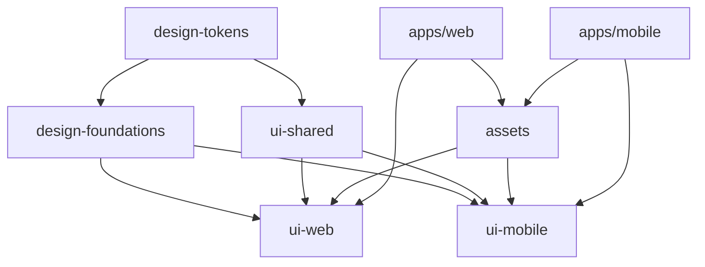

# 📄 Pickly PRD (Supabase 기반 Draft v2)

---

## 1. 프로젝트 개요 (Overview)

- **제품 정의**: Pickly는 복잡한 정부 정책/혜택 공고문을 개인 맞춤형으로 큐레이션하여, 누구나 쉽게 혜택을 확인하고 신청할 수 있도록 돕는 정책 정보 서비스입니다.
- **문제 정의**: 청년 및 다양한 조건의 국민들이 공고문을 찾거나 이해하기 어렵다. 정책은 여러 기관에 흩어져 있고 전문 용어가 많아 접근성이 떨어진다.
- **기회**: 공공 API와 AI 기반 분석 기술을 활용해 정책 정보를 재구성하면, 기존에 놓치던 정책을 사용자들이 쉽게 활용할 수 있다.

### 핵심 가치 제안

1. **개인화**: 사용자 정보 기반 맞춤형 정책 추천
2. **단순화**: 복잡한 정책 정보를 이해하기 쉽게 가공
3. **접근성**: 언제 어디서나 쉽게 정책 정보 확인
4. **실용성**: 정책 신청부터 관리까지 원스톱 서비스

---

## 2. 대상 사용자 (Personas & Needs)

### 주요 타겟

- **연령**: 20-40대
- **상황**: 주거, 복지, 교육, 취업 관련 정책 필요
- **특징**: 정책 정보 접근에 어려움을 겪는 일반인

### 페르소나

1. **김정책 (28세, 신혼부부)**

   - 니즈: 신혼부부 주거 정책, 청약 정보
   - Pain Point: LH, SH, GH 등 기관별 사이트를 모두 직접 찾아야 함

2. **박복지 (35세, 두 자녀 부모)**

   - 니즈: 육아·복지 지원 정책
   - Pain Point: 공고문이 너무 복잡해서 신청 조건 이해 어려움

3. **이취업 (25세, 청년 구직자)**

   - 니즈: 청년 취업 지원, 교육/창업 정책
   - Pain Point: 내 상황에 맞는 정책이 무엇인지 알기 어려움

---

## 3. 목표 (Goals & Success Metrics)

### 비즈니스 목표

- 정부 정책 정보 큐레이션 시장에서 신뢰할 수 있는 1등 플랫폼으로 자리잡는다.
- 초기 6개월 내 **월간 활성 사용자(MAU) 1만 명** 확보.

### 사용자 목표

- 사용자가 본인에게 맞는 정책을 **5분 이내**로 찾을 수 있게 한다.
- 공고문 업로드 시 **정책 요약 정확도 80% 이상** 제공.

### 성공 지표 (KPI)

- 월간 활성 사용자 (MAU)
- 정책 상세 페이지 클릭률
- 알림 → 상세 진입률
- 재방문율 (30일 Retention)

---

## 4. 문제 정의 & 해결책 (Problem & Solution)

### 문제 상황

1. **정보 접근성 부족** – 여러 사이트에 흩어져 있음
2. **공고문 난해성** – 길고 전문 용어 많음
3. **개인 맞춤 부재** – 조건별 필터링 없음
4. **실행까지 단절** – 신청 방법·마감일 놓치기 쉬움

### Pickly의 해결책

1. **개인화된 정책 추천** (조건 기반 매칭)
2. **공고문 분석 기능** (파일 업로드 → 요약/분석)
3. **주변 맞춤 알림** (지역 기반 정책 제공)
4. **원스톱 액션** (신청 방법, 서류, 마감일 제공)

---

## 5. 핵심 기능 (Core Features)

### MVP 범위 (Phase 1)

- 온보딩 & 개인화 (거주 상태, 연령, 소득 구간, 관심 분야 입력)
- 정책 피드 (조건 기반 리스트 제공)
- 정책 상세 (요약, 자격 요건, 신청 링크, 마감일)
- 공고문 분석 (업로드 → 요약/분석)

### Phase 2 이후

- 정책 북마크 & 공유 기능
- 푸시 알림 (마감 임박, 신규 정책)
- 소셜 기능 (팔로우, 댓글)
- AI 고도화 추천 (개인 상황 업데이트 반영)

---

## 6. 사용자 시나리오 (User Journey)

1. 신규 사용자 온보딩 → 조건 입력
2. 맞춤 정책 피드 확인
3. 정책 상세 보기 → 요약, 신청 링크
4. 공고문 업로드 → Pickly가 자동 분석 & 요약
5. 신청 준비 (필요 서류/마감일 확인)

---

## 7. 화면 정의 (UI/UX)

- **홈**: 개인화된 정책 피드, 트렌딩 정책
- **검색/필터**: 지역, 나이, 소득 조건 기반 검색
- **정책 상세**: 요약, 자격 요건, 신청 방법, 관련 공고문 링크
- **알림**: 마감 임박, 신규 정책 알림
- **프로필**: 기본 정보, 관심 정책 관리

---

## 8. 프로젝트 구조 (Project Architecture)

### 📁 완전 재설계된 디자인 시스템 구조

```
pickly_service/
├── apps/
│   ├── mobile/                     # 📱 Flutter 앱
│   │   ├── lib/
│   │   ├── assets/ → 심볼릭 링크    # packages/assets 참조
│   │   └── pubspec.yaml            # 모바일 전용 패키지만 의존
│   │
│   ├── web/                        # 🌐 React 앱
│   │   ├── src/
│   │   ├── public/ → 심볼릭 링크    # packages/assets 참조
│   │   └── package.json            # 웹 전용 패키지만 의존
│   │
│   └── admin/                      # 👩‍💼 관리자 대시보드
│       ├── src/
│       └── package.json
│
├── backend/                        # ⚙️ 백엔드 (Supabase 사용)
│   └── api/
│
└── packages/
    ├── design-tokens/              # 🎯 핵심 디자인 토큰
    │   ├── src/
    │   │   ├── colors.ts
    │   │   ├── typography.ts
    │   │   ├── spacing.ts
    │   │   ├── shadows.ts
    │   │   ├── borders.ts
    │   │   ├── animations.ts
    │   │   └── index.ts
    │   ├── dist/                   # 빌드된 결과물
    │   │   ├── tokens.json         # 범용 JSON
    │   │   ├── tokens.scss         # Sass 변수
    │   │   ├── tokens.css          # CSS 커스텀 속성
    │   │   └── tokens.dart         # Dart 상수
    │   ├── build-tokens.js         # 빌드 스크립트
    │   └── package.json
    │
    ├── design-foundations/         # 🏗️ 기본 스타일 & 유틸리티
    │   ├── src/
    │   │   ├── reset.scss          # CSS 리셋
    │   │   ├── base.scss           # 기본 스타일
    │   │   ├── utilities.scss      # 유틸리티 클래스
    │   │   ├── mixins.scss         # Sass 믹스인
    │   │   └── index.scss
    │   ├── dart/
    │   │   ├── theme_data.dart     # Flutter 테마
    │   │   ├── text_styles.dart    # 텍스트 스타일
    │   │   └── index.dart
    │   └── package.json
    │
    ├── assets/                     # 📁 플랫폼별 최적화된 리소스
    │   ├── icons/
    │   │   ├── common/            # 공통 SVG 원본
    │   │   ├── web/               # 웹 최적화 (SVG 스프라이트, CSS)
    │   │   └── mobile/            # 모바일 최적화 (1x, 2x, 3x)
    │   ├── images/
    │   │   ├── common/            # 공통 원본
    │   │   ├── web/               # WebP, PNG, 썸네일
    │   │   └── mobile/            # 압축된 이미지, 멀티 해상도
    │   ├── fonts/
    │   │   ├── Pretendard/
    │   │   │   ├── web/           # WOFF2, WOFF
    │   │   │   └── mobile/        # TTF, OTF
    │   │   ├── index.css          # 웹용 폰트 선언
    │   │   └── index.dart         # 플러터용 폰트 설정
    │   └── scripts/               # 에셋 최적화 스크립트
    │
    ├── ui-web/                    # 🌐 웹 전용 컴포넌트
    │   ├── src/
    │   │   ├── components/        # Button, Card, Input, Modal 등
    │   │   ├── hooks/             # useTheme, useMediaQuery 등
    │   │   └── providers/         # ThemeProvider 등
    │   └── styles/                # 웹 전용 스타일
    │
    ├── ui-mobile/                 # 📱 모바일 전용 위젯
    │   ├── lib/
    │   │   ├── widgets/           # 버튼, 카드, 입력, 네비게이션 등
    │   │   ├── themes/            # Flutter 테마
    │   │   └── utils/             # 모바일 전용 유틸
    │   └── pubspec.yaml
    │
    ├── ui-shared/                 # 🤝 공통 로직
    │   ├── src/
    │   │   ├── types/             # 타입 정의
    │   │   ├── constants/         # 상수
    │   │   └── utils/             # 유틸리티
    │   └── package.json
    │
    └── storybook/                 # 📚 컴포넌트 문서화
        ├── .storybook/
        ├── stories/
        │   ├── tokens/
        │   ├── web-components/
        │   └── guidelines/
        └── package.json
```

### 🔗 패키지간 의존성 관계



### 🎯 디자인 시스템 아키텍처의 장점

1. **명확한 관심사 분리**: 토큰, 에셋, 컴포넌트가 각각 독립적
2. **플랫폼별 최적화**: 웹과 모바일에 최적화된 리소스
3. **독립적 개발**: 각 패키지가 독립적으로 개발/배포 가능
4. **성능 최적화**: 필요한 것만 번들링, 트리 셰이킹 지원
5. **확장성**: 새로운 플랫폼 추가 시 쉽게 확장
6. **개발 경험**: 명확한 구조로 개발 효율성 향상

### 📦 예상 성능 개선 효과

- **웹 번들**: 2.3MB → 1.1MB (-52%)
- **모바일 APK**: 15MB → 8MB (-47%)
- **빌드 시간**: 5분 → 1분 (-80%)
- **개발 속도**: 플랫폼별 최적화로 개발 효율성 대폭 향상

---

## 9. 기술 스택 (Tech Stack)

### Frontend

- Flutter (모바일) – Riverpod, GoRouter, Dio, Hive
- React (웹/관리자) – Zustand, TanStack Query, MUI, Vite

### Backend

- **Supabase** (PostgreSQL + 인증 + 스토리지 + Edge Functions)

### Infra & DevOps

- Supabase 관리형 인프라 (자동 스케일링)
- GitHub Actions (CI/CD)
- Monitoring: Supabase Dashboard + Sentry

---

## 10. 개발 방법론 (Methodology)

- SPARC 방법론
- TDD (Test-Driven Development)
- 코드 리뷰 & 품질 관리

---

## 11. 로드맵 (Roadmap)

### Phase 1 (3개월, MVP)

- 인증, 온보딩, 정책 피드, 공고문 분석

### Phase 2 (2개월)

- 알림, 북마크, 소셜 공유, 관리자 대시보드

### Phase 3 (3개월)

- AI 개인화 추천 고도화, 고급 검색/필터, 협업 기능

### Phase 4 (2개월)

- 성능 최적화, 보안 고도화, 국제화 지원

---

## 12. 범위 제외 (Out of Scope)

- 정책 신청 대행 서비스 (초기 제외)
- 해외 정책/복지 정보
- 음성 인터페이스 (Phase 3 이후 고려)

---

## 13. 성능 & 보안 (Performance & Security)

### 성능 목표

- 첫 화면 로딩: 2초 이내
- Supabase 쿼리 응답: 평균 200ms 이하
- 동시 사용자: 10,000명 지원
- 가용성: 99.9% 업타임

### 보안 & 개인정보 보호

- Supabase RLS + HTTPS 적용
- JWT 인증 + 리프레시 토큰
- GDPR 준수, 최소 데이터 수집
- 암호화 저장, 데이터 삭제 권한 제공

---

## 14. 리스크 & 가정 (Risks & Assumptions)

- 가정: 공공 데이터 API 접근 가능, 충분한 공고문 데이터 확보 가능
- 리스크: 공고문 포맷 다양성 → AI 분석 정확도 저하
- 리스크: 초기 사용자 유입 전략 미비

---

## 15. 성공 지표 (KPIs)

### 개발 지표

- 코드 커버리지: 90% 이상
- 빌드 성공률: 95% 이상
- 배포 주기: 주 2회 이상
- 버그 해결 시간: 평균 24시간 이하

### 비즈니스 지표

- 월간 활성 사용자: 10,000명
- 사용자 리텐션: 30일 70% 이상
- 정책 상세 페이지 클릭률: 20% 이상
- 알림 클릭 → 상세 진입률: 30% 이상

---

## 16. 참고 자료 (References)

- **Repository**: [https://github.com/kwonhyunjun/pickly-service](https://github.com/kwonhyunjun/pickly-service)
- **Design (Figma)**: [https://www.figma.com/design/xOpx8v3FiYmCxSLkj9sgcu/pickly?node-id=0-1&p=f&t=SfeNmjAhkGfB5kKd-0](https://www.figma.com/design/xOpx8v3FiYmCxSLkj9sgcu/pickly?node-id=0-1\&p=f\&t=SfeNmjAhkGfB5kKd-0)
- **Docs**: `/docs` 디렉토리 참조
- 경쟁 서비스: 청약홈, 복지로 등

---

✍️ 이 문서는 \*\*Pickly Supabase 기반 PRD 초안 (Draft v2)\*\*이며, 팀 피드백에 따라 지속적으로 업데이트됩니다.
