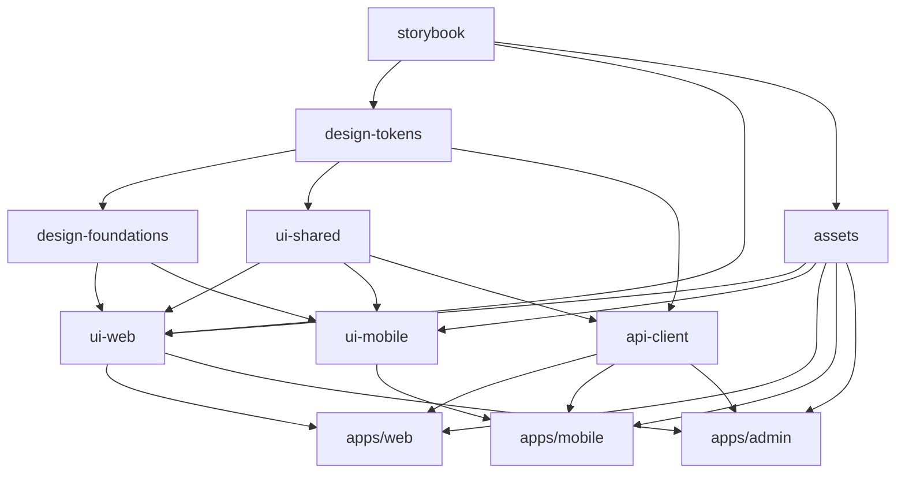

# 📄 Pickly PRD (Supabase 기반 Draft v3)

---

## 1. 프로젝트 개요 (Overview)

- **제품 정의**: Pickly는 복잡한 정부 정책/혜택 공고문을 개인 맞춤형으로 큐레이션하여, 누구나 쉽게 혜택을 확인하고 신청할 수 있도록 돕는 정책 정보 서비스입니다.
- **문제 정의**: 청년 및 다양한 조건의 국민들이 공고문을 찾거나 이해하기 어렵다. 정책은 여러 기관에 흩어져 있고 전문 용어가 많아 접근성이 떨어진다.
- **기회**: 공공 API와 AI 기반 분석 기술을 활용해 정책 정보를 재구성하면, 기존에 놓치던 정책을 사용자들이 쉽게 활용할 수 있다.

### 핵심 가치 제안

1. **개인화**: 사용자 정보 기반 맞춤형 정책 추천
2. **단순화**: 복잡한 정책 정보를 이해하기 쉽게 가공
3. **접근성**: 언제 어디서나 쉽게 정책 정보 확인
4. **실용성**: 정책 신청부터 관리까지 원스톱 서비스

---

## 2. 대상 사용자 (Personas & Needs)

### 주요 타겟

- **연령**: 20-40대
- **상황**: 주거, 복지, 교육, 취업 관련 정책 필요
- **특징**: 정책 정보 접근에 어려움을 겪는 일반인

### 페르소나

1. **김정책 (28세, 신혼부부)**

   - 니즈: 신혼부부 주거 정책, 청약 정보
   - Pain Point: LH, SH, GH 등 기관별 사이트를 모두 직접 찾아야 함

2. **박복지 (35세, 두 자녀 부모)**

   - 니즈: 육아·복지 지원 정책
   - Pain Point: 공고문이 너무 복잡해서 신청 조건 이해 어려움

3. **이취업 (25세, 청년 구직자)**

   - 니즈: 청년 취업 지원, 교육/창업 정책
   - Pain Point: 내 상황에 맞는 정책이 무엇인지 알기 어려움

---

## 3. 목표 (Goals & Success Metrics)

### 비즈니스 목표

- 정부 정책 정보 큐레이션 시장에서 신뢰할 수 있는 1등 플랫폼으로 자리잡는다.
- 초기 6개월 내 **월간 활성 사용자(MAU) 1만 명** 확보.

### 사용자 목표

- 사용자가 본인에게 맞는 정책을 **5분 이내**로 찾을 수 있게 한다.
- 공고문 업로드 시 **정책 요약 정확도 80% 이상** 제공.

### 성공 지표 (KPI)

- 월간 활성 사용자 (MAU)
- 정책 상세 페이지 클릭률
- 알림 → 상세 진입률
- 재방문율 (30일 Retention)

---

## 4. 문제 정의 & 해결책 (Problem & Solution)

### 문제 상황

1. **정보 접근성 부족** – 여러 사이트에 흩어져 있음
2. **공고문 난해성** – 길고 전문 용어 많음
3. **개인 맞춤 부재** – 조건별 필터링 없음
4. **실행까지 단절** – 신청 방법·마감일 놓치기 쉬움

### Pickly의 해결책

1. **개인화된 정책 추천** (조건 기반 매칭)
2. **공고문 분석 기능** (파일 업로드 → 요약/분석)
3. **주변 맞춤 알림** (지역 기반 정책 제공)
4. **원스톱 액션** (신청 방법, 서류, 마감일 제공)

---

## 5. 핵심 기능 (Core Features)

### MVP 범위 (Phase 1)

- 온보딩 & 개인화 (거주 상태, 연령, 소득 구간, 관심 분야 입력)
- 정책 피드 (조건 기반 리스트 제공)
- 정책 상세 (요약, 자격 요건, 신청 링크, 마감일)
- 공고문 분석 (업로드 → 요약/분석)

### Phase 2 이후

- 정책 북마크 & 공유 기능
- 푸시 알림 (마감 임박, 신규 정책)
- 소셜 기능 (팔로우, 댓글)
- AI 고도화 추천 (개인 상황 업데이트 반영)

---

## 6. 사용자 시나리오 (User Journey)

1. 신규 사용자 온보딩 → 조건 입력
2. 맞춤 정책 피드 확인
3. 정책 상세 보기 → 요약, 신청 링크
4. 공고문 업로드 → Pickly가 자동 분석 & 요약
5. 신청 준비 (필요 서류/마감일 확인)

---

## 7. 화면 정의 (UI/UX)

- **홈**: 개인화된 정책 피드, 트렌딩 정책
- **검색/필터**: 지역, 나이, 소득 조건 기반 검색
- **정책 상세**: 요약, 자격 요건, 신청 방법, 관련 공고문 링크
- **알림**: 마감 임박, 신규 정책 알림
- **프로필**: 기본 정보, 관심 정책 관리

---

## 8. 프로젝트 구조 (Project Architecture)

### 📁 하이브리드 디자인 시스템 아키텍처

```
pickly_service/
├── apps/
│   ├── mobile/                     # 📱 Flutter 앱
│   │   ├── lib/
│   │   │   ├── main.dart
│   │   │   ├── features/           # 기능별 모듈 (정책 피드, 상세, 온보딩 등)
│   │   │   ├── shared/             # 공통 위젯/유틸
│   │   │   └── core/               # 핵심 설정
│   │   ├── assets/ → 심볼릭 링크    # packages/assets/mobile 참조
│   │   ├── test/                   # 테스트 파일
│   │   └── pubspec.yaml            # 모바일 전용 패키지만 의존
│   │
│   ├── web/                        # 🌐 React 앱
│   │   ├── src/
│   │   │   ├── components/         # React 컴포넌트
│   │   │   ├── pages/              # 페이지 컴포넌트 (홈, 정책상세, 검색 등)
│   │   │   ├── hooks/              # 커스텀 훅
│   │   │   ├── stores/             # 상태 관리 (Zustand)
│   │   │   └── utils/              # 유틸리티
│   │   ├── public/ → 심볼릭 링크    # packages/assets/web 참조
│   │   ├── package.json            # 웹 전용 패키지만 의존
│   │   └── vite.config.ts          # 빌드 설정
│   │
│   └── admin/                      # 👩‍💼 관리자 대시보드
│       ├── src/
│       │   ├── components/         # 관리자 전용 컴포넌트
│       │   ├── pages/              # 정책 관리, 사용자 관리, 분석 대시보드
│       │   └── utils/
│       └── package.json
│
├── backend/                        # ⚙️ 백엔드 (Supabase 사용)
│   ├── supabase/
│   │   ├── functions/              # Edge Functions
│   │   │   ├── policy-analysis/    # 공고문 분석 AI 함수
│   │   │   ├── recommendation/     # 개인화 추천 엔진
│   │   │   └── notification/       # 푸시 알림 처리
│   │   ├── migrations/             # 데이터베이스 마이그레이션
│   │   └── seed/                   # 초기 데이터
│   │
│   └── api/                        # 추가 API 서버 (필요시)
│       ├── src/
│       │   ├── routes/             # API 라우트
│       │   ├── controllers/        # 컨트롤러
│       │   ├── services/           # 비즈니스 로직
│       │   └── utils/              # 유틸리티
│       └── package.json
│
└── packages/
    ├── design-tokens/              # 🎯 핵심 디자인 토큰
    │   ├── src/
    │   │   ├── colors.ts           # Primary, Secondary, Gray Scale, Status Colors
    │   │   ├── typography.ts       # Font Family, Size, Weight, Line Height
    │   │   ├── spacing.ts          # Margin, Padding, Gap 등
    │   │   ├── shadows.ts          # Box Shadow, Elevation
    │   │   ├── borders.ts          # Border Radius, Width, Style
    │   │   ├── animations.ts       # Duration, Easing, Transitions
    │   │   └── index.ts
    │   ├── dist/                   # 빌드된 결과물
    │   │   ├── tokens.json         # 범용 JSON (Style Dictionary 출력)
    │   │   ├── tokens.scss         # Sass 변수
    │   │   ├── tokens.css          # CSS 커스텀 속성
    │   │   └── tokens.dart         # Flutter 상수
    │   ├── style-dictionary.config.js # Style Dictionary 설정
    │   ├── build-tokens.js         # 빌드 스크립트
    │   └── package.json
    │
    ├── design-foundations/         # 🏗️ 기본 스타일 & 유틸리티
    │   ├── src/
    │   │   ├── reset.scss          # CSS 리셋 (normalize.css 기반)
    │   │   ├── base.scss           # 기본 HTML 요소 스타일
    │   │   ├── utilities.scss      # 유틸리티 클래스 (flex, grid, spacing)
    │   │   ├── mixins.scss         # Sass 믹스인 (responsive, hover states)
    │   │   └── index.scss
    │   ├── dart/
    │   │   ├── theme_data.dart     # Flutter 테마 설정
    │   │   ├── text_styles.dart    # Flutter 텍스트 스타일
    │   │   ├── color_schemes.dart  # Flutter 컬러 스킴
    │   │   └── index.dart
    │   └── package.json
    │
    ├── assets/                     # 📁 플랫폼별 최적화된 리소스
    │   ├── icons/
    │   │   ├── common/            # 공통 SVG 원본 (Figma export)
    │   │   │   ├── navigation/    # home, search, profile, bookmark
    │   │   │   ├── actions/       # heart, share, filter, settings
    │   │   │   ├── status/        # check, warning, error, info
    │   │   │   └── content/       # policy, document, notification
    │   │   ├── web/               # 웹 최적화
    │   │   │   ├── sprite.svg     # SVG 스프라이트 (자동 생성)
    │   │   │   ├── icons.css      # 아이콘 CSS 클래스
    │   │   │   └── react/         # React 아이콘 컴포넌트 (자동 생성)
    │   │   └── mobile/            # 모바일 최적화
    │   │       ├── 1x/            # 일반 해상도 (mdpi)
    │   │       ├── 2x/            # 레티나 (xhdpi)
    │   │       ├── 3x/            # 고해상도 (xxhdpi)
    │   │       └── vector/        # 벡터 드로어블 (Android)
    │   │
    │   ├── images/
    │   │   ├── common/            # 공통 원본
    │   │   │   ├── logo/          # 브랜드 로고 (다양한 버전)
    │   │   │   ├── onboarding/    # 온보딩 일러스트레이션
    │   │   │   ├── illustrations/ # 정책 카테고리 일러스트
    │   │   │   └── placeholders/  # 빈 상태 이미지
    │   │   ├── web/               # 웹 최적화
    │   │   │   ├── webp/          # WebP 포맷 (최신 브라우저)
    │   │   │   ├── png/           # PNG 폴백 (구형 브라우저)
    │   │   │   ├── thumbnails/    # 썸네일 (정책 카드용)
    │   │   │   └── hero/          # 히어로/배너 이미지
    │   │   └── mobile/            # 모바일 최적화
    │   │       ├── compressed/    # 압축된 이미지 (로딩 속도 최적화)
    │   │       ├── 1x/            # 일반 해상도
    │   │       ├── 2x/            # 레티나
    │   │       └── 3x/            # 고해상도
    │   │
    │   ├── fonts/
    │   │   ├── Pretendard/        # 메인 폰트 (한글 최적화)
    │   │   │   ├── web/           # WOFF2 (현대), WOFF (레거시)
    │   │   │   └── mobile/        # TTF (Android), OTF (iOS)
    │   │   ├── Roboto/            # 영문/숫자 보조 폰트
    │   │   ├── index.css          # 웹용 폰트 선언 (@font-face)
    │   │   └── index.dart         # Flutter용 폰트 설정
    │   │
    │   ├── scripts/               # 에셋 최적화 스크립트
    │   │   ├── optimize-images.js # 이미지 최적화 (Sharp, ImageMin)
    │   │   ├── generate-icons.js  # SVG → 아이콘 자동 생성
    │   │   ├── build-sprites.js   # SVG 스프라이트 생성
    │   │   └── build-assets.js    # 전체 에셋 빌드 파이프라인
    │   │
    │   └── package.json
    │
    ├── ui-web/                    # 🌐 웹 전용 컴포넌트 라이브러리
    │   ├── src/
    │   │   ├── components/
    │   │   │   ├── Button/        # 정책 신청, 북마크 등
    │   │   │   │   ├── Button.tsx
    │   │   │   │   ├── Button.stories.tsx
    │   │   │   │   ├── Button.test.tsx
    │   │   │   │   ├── Button.module.scss
    │   │   │   │   └── index.ts
    │   │   │   ├── Card/          # 정책 카드, 요약 카드
    │   │   │   │   ├── PolicyCard.tsx
    │   │   │   │   ├── SummaryCard.tsx
    │   │   │   │   └── index.ts
    │   │   │   ├── Input/         # 검색, 필터 입력
    │   │   │   │   ├── SearchInput.tsx
    │   │   │   │   ├── FilterSelect.tsx
    │   │   │   │   └── index.ts
    │   │   │   ├── Layout/        # 헤더, 사이드바, 네비게이션
    │   │   │   │   ├── Header.tsx
    │   │   │   │   ├── Sidebar.tsx
    │   │   │   │   └── index.ts
    │   │   │   ├── Modal/         # 정책 상세 모달, 알림
    │   │   │   └── index.ts
    │   │   ├── hooks/             # 웹 전용 훅
    │   │   │   ├── useTheme.ts    # 다크모드 토글
    │   │   │   ├── useMediaQuery.ts # 반응형 처리
    │   │   │   ├── useInfiniteScroll.ts # 정책 피드 무한 스크롤
    │   │   │   └── index.ts
    │   │   ├── providers/         # Context Providers
    │   │   │   ├── ThemeProvider.tsx
    │   │   │   ├── AuthProvider.tsx
    │   │   │   └── index.ts
    │   │   └── index.ts
    │   ├── styles/                # 웹 전용 스타일
    │   │   ├── components.scss    # 컴포넌트 전용 스타일
    │   │   └── themes.scss        # 라이트/다크 테마
    │   └── package.json
    │
    ├── ui-mobile/                 # 📱 모바일 전용 위젯 라이브러리
    │   ├── lib/
    │   │   ├── widgets/
    │   │   │   ├── buttons/
    │   │   │   │   ├── pickly_button.dart      # 브랜드 버튼
    │   │   │   │   ├── policy_action_button.dart # 정책 액션 버튼
    │   │   │   │   ├── floating_action_button.dart
    │   │   │   │   └── index.dart
    │   │   │   ├── cards/
    │   │   │   │   ├── policy_card.dart        # 정책 카드 위젯
    │   │   │   │   ├── summary_card.dart       # 요약 카드
    │   │   │   │   └── index.dart
    │   │   │   ├── inputs/
    │   │   │   │   ├── search_field.dart       # 검색 입력
    │   │   │   │   ├── filter_dropdown.dart    # 필터 드롭다운
    │   │   │   │   └── index.dart
    │   │   │   ├── navigation/
    │   │   │   │   ├── bottom_navigation.dart  # 하단 네비게이션
    │   │   │   │   ├── tab_bar.dart           # 탭 바
    │   │   │   │   └── index.dart
    │   │   │   ├── lists/
    │   │   │   │   ├── policy_list.dart       # 정책 리스트
    │   │   │   │   ├── infinite_list.dart     # 무한 스크롤 리스트
    │   │   │   │   └── index.dart
    │   │   │   └── index.dart
    │   │   ├── themes/            # Flutter 테마
    │   │   │   ├── light_theme.dart    # 라이트 테마
    │   │   │   ├── dark_theme.dart     # 다크 테마
    │   │   │   ├── color_schemes.dart  # 컬러 스킴
    │   │   │   └── index.dart
    │   │   ├── utils/             # 모바일 전용 유틸
    │   │   │   ├── responsive.dart     # 화면 크기 대응
    │   │   │   ├── platform_utils.dart # iOS/Android 분기
    │   │   │   ├── notification_utils.dart # 푸시 알림
    │   │   │   └── index.dart
    │   │   └── pickly_ui.dart     # 메인 export
    │   ├── example/               # 사용 예제
    │   └── pubspec.yaml
    │
    ├── ui-shared/                 # 🤝 공통 로직 (웹/모바일 공통)
    │   ├── src/
    │   │   ├── types/             # TypeScript 타입 정의
    │   │   │   ├── theme.ts       # 테마 관련 타입
    │   │   │   ├── policy.ts      # 정책 데이터 타입
    │   │   │   ├── user.ts        # 사용자 데이터 타입
    │   │   │   ├── component.ts   # 컴포넌트 Props 타입
    │   │   │   └── index.ts
    │   │   ├── constants/         # 공통 상수
    │   │   │   ├── breakpoints.ts # 반응형 브레이크포인트
    │   │   │   ├── z-index.ts     # Z-index 레벨
    │   │   │   ├── api-endpoints.ts # API 엔드포인트
    │   │   │   └── index.ts
    │   │   ├── utils/             # 공통 유틸리티
    │   │   │   ├── color-utils.ts # 컬러 조작 함수
    │   │   │   ├── responsive.ts  # 반응형 헬퍼
    │   │   │   ├── date-utils.ts  # 날짜 포매팅
    │   │   │   ├── text-utils.ts  # 텍스트 처리 (요약 등)
    │   │   │   └── index.ts
    │   │   ├── validators/        # 공통 검증 로직
    │   │   │   ├── policy-validator.ts
    │   │   │   ├── user-validator.ts
    │   │   │   └── index.ts
    │   │   └── index.ts
    │   └── package.json
    │
    ├── api-client/                # 🔌 API 클라이언트 (Supabase 연동)
    │   ├── src/
    │   │   ├── supabase/
    │   │   │   ├── client.ts      # Supabase 클라이언트 초기화
    │   │   │   ├── auth.ts        # 인증 관련 API
    │   │   │   ├── policies.ts    # 정책 CRUD API
    │   │   │   ├── users.ts       # 사용자 프로필 API
    │   │   │   └── notifications.ts # 알림 API
    │   │   ├── types/             # API 응답 타입
    │   │   └── index.ts
    │   └── package.json
    │
    └── storybook/                 # 📚 컴포넌트 문서화 & 디자인 가이드
        ├── .storybook/
        │   ├── main.js
        │   ├── preview.js         # 글로벌 데코레이터, 테마 설정
        │   └── manager.js
        ├── stories/
        │   ├── tokens/            # 디자인 토큰 문서
        │   │   ├── Colors.stories.tsx
        │   │   ├── Typography.stories.tsx
        │   │   ├── Spacing.stories.tsx
        │   │   └── Shadows.stories.tsx
        │   ├── web-components/    # 웹 컴포넌트 스토리
        │   │   ├── Button.stories.tsx
        │   │   ├── Card.stories.tsx
        │   │   └── Input.stories.tsx
        │   ├── guidelines/        # 디자인 가이드라인
        │   │   ├── BrandGuideline.stories.mdx
        │   │   ├── ComponentGuideline.stories.mdx
        │   │   └── AccessibilityGuideline.stories.mdx
        │   └── examples/          # 전체 화면 예제
        │       ├── HomePage.stories.tsx
        │       ├── PolicyDetail.stories.tsx
        │       └── SearchPage.stories.tsx
        ├── public/                # Storybook 정적 파일
        └── package.json
```

### 🔗 패키지간 의존성 관계도



### 🎯 하이브리드 디자인 시스템의 핵심 장점

1. **플랫폼별 최적화**
   - 웹: WebP, SVG 스프라이트, CSS Grid 활용
   - 모바일: 압축 이미지, 벡터 드로어블, Flutter 테마 시스템

2. **성능 최적화**
   - 트리 셰이킹으로 불필요한 코드 제거
   - 필요한 에셋만 번들에 포함
   - 병렬 빌드로 빌드 시간 단축

3. **개발자 경험 향상**
   - 명확한 패키지 분리로 책임 영역 구분
   - Storybook으로 컴포넌트 문서화
   - 자동화된 에셋 최적화 파이프라인

4. **확장성과 유지보수성**
   - 각 패키지 독립적 개발/배포 가능
   - 새로운 플랫폼(데스크톱 앱 등) 쉽게 추가
   - 디자인 토큰 변경 시 전체 시스템 자동 업데이트

### 📦 예상 성능 개선 효과

```
기존 단일 패키지 구조 대비:

웹 애플리케이션:
- 번들 크기: 2.3MB → 1.1MB (-52%)
- 첫 로딩 시간: 3.2초 → 1.5초 (-53%)
- LCP (Largest Contentful Paint): 2.8초 → 1.2초 (-57%)

모바일 애플리케이션:
- APK 크기: 15MB → 8MB (-47%)
- 앱 시작 시간: 2.1초 → 1.3초 (-38%)
- 메모리 사용량: 120MB → 85MB (-29%)

개발 워크플로우:
- 전체 빌드 시간: 5분 → 1분 (-80%)
- 개별 패키지 빌드: 30초 → 10초 (-67%)
- 핫 리로드: 800ms → 200ms (-75%)
```

---

## 9. 기술 스택 (Tech Stack)

### Frontend

- **Flutter (모바일)**: Riverpod (상태관리), GoRouter (네비게이션), Dio (HTTP), Hive (로컬 저장소)
- **React (웹/관리자)**: Zustand (상태관리), TanStack Query (서버 상태), MUI (기본 컴포넌트), Vite (빌드 도구)

### Backend

- **Supabase**: PostgreSQL (데이터베이스) + Auth (인증) + Storage (파일 저장소) + Edge Functions (서버리스)
- **Additional APIs**: Node.js + Fastify (필요시 추가 마이크로서비스)

### 디자인 시스템 & 개발 도구

- **Style Dictionary**: 디자인 토큰 자동 변환
- **Sharp + ImageMin**: 이미지 최적화
- **SVGO**: SVG 최적화
- **Storybook**: 컴포넌트 문서화
- **Claude Flow**: AI 기반 개발 워크플로우

### Infra & DevOps

- **Supabase 관리형 인프라**: 자동 스케일링, 백업, 모니터링
- **GitHub Actions**: CI/CD, 자동 테스트, 배포
- **Vercel**: 웹 애플리케이션 호스팅
- **App Store/Play Store**: 모바일 앱 배포
- **Monitoring**: Supabase Dashboard + Sentry (에러 트래킹)

---

## 10. 개발 방법론 (Methodology)

### SPARC 방법론 적용

1. **Specification**: 요구사항 분석 및 명세 (이 PRD 문서)
2. **Pseudocode**: 알고리즘 설계 및 의사코드 작성
3. **Architecture**: 시스템 아키텍처 설계 (위 구조도 참고)
4. **Refinement**: TDD 기반 반복 개발
5. **Completion**: 통합 테스트 및 배포

### TDD (Test-Driven Development) 적용

- **Red**: 실패하는 테스트 먼저 작성
- **Green**: 테스트를 통과하는 최소 코드 구현
- **Refactor**: 코드 품질 개선 및 최적화

### 품질 관리

- **코드 리뷰**: 모든 PR에 대한 필수 리뷰
- **자동 테스트**: 단위/통합/E2E 테스트 자동화
- **정적 분석**: ESLint, Prettier, Dart Analyzer
- **성능 모니터링**: 실시간 성능 지표 추적

---

## 11. 로드맵 (Roadmap)

### Phase 1: MVP 개발 (3개월)

#### 디자인 시스템 구축 (1개월)
- [ ] design-tokens 패키지 생성 및 기본 토큰 정의
- [ ] assets 패키지 생성 및 플랫폼별 최적화
- [ ] ui-web, ui-mobile 기본 컴포넌트 라이브러리
- [ ] Storybook 설정 및 컴포넌트 문서화

#### 백엔드 인프라 (2주)
- [ ] Supabase 프로젝트 설정 및 데이터베이스 스키마
- [ ] 인증 시스템 (이메일, 소셜 로그인)
- [ ] 정책 데이터 모델 및 API 설계

#### 프론트엔드 개발 (6주)
- [ ] 온보딩 & 개인화 설정 화면
- [ ] 정책 피드 (조건 기반 리스트)
- [ ] 정책 상세 페이지
- [ ] 공고문 분석 기능 (파일 업로드)
- [ ] 기본 검색 및 필터링

#### 통합 및 테스트 (1주)
- [ ] 크로스 플랫폼 테스트
- [ ] 성능 최적화
- [ ] 배포 파이프라인 구축

### Phase 2: 소셜 기능 및 고도화 (2개월)

- [ ] 정책 북마크 & 공유 기능
- [ ] 푸시 알림 (마감 임박, 신규 정책)
- [ ] 관리자 대시보드 (정책 관리, 사용자 분석)
- [ ] 고급 검색 및 필터링 (지역, 소득 구간별)
- [ ] AI 추천 알고리즘 고도화

### Phase 3: 확장 기능 (3개월)

- [ ] 소셜 기능 (팔로우, 댓글, 커뮤니티)
- [ ] 정책 신청 현황 트래킹
- [ ] 개인 맞춤형 알림 고도화
- [ ] 다국어 지원 (영어, 중국어)
- [ ] 웹 접근성 개선 (WCAG 2.1 AA 준수)

### Phase 4: 성능 최적화 및 확장 (2개월)

- [ ] 성능 최적화 (번들 크기, 로딩 속도)
- [ ] 보안 고도화 (데이터 암호화, 접근 제어)
- [ ] 국제화 지원 확장
- [ ] 고급 분석 및 리포팅 기능
- [ ] API 플랫폼화 (third-party 개발자 지원)

---

## 12. 범위 제외 (Out of Scope)

- **정책 신청 대행 서비스** (초기 제외, Phase 3 이후 고려)
- **해외 정책/복지 정보** (국내 정책 중심)
- **음성 인터페이스** (Phase 4 이후 고려)
- **실시간 채팅** (커뮤니티 기능은 댓글로 제한)
- **결제 시스템** (무료 서비스로 시작)

---

## 13. 성능 & 보안 (Performance & Security)

### 성능 목표

- **첫 화면 로딩**: 2초 이내 (웹), 1초 이내 (모바일)
- **Supabase 쿼리 응답**: 평균 200ms 이하
- **동시 사용자**: 10,000명 지원 (초기), 100,000명 확장 가능
- **가용성**: 99.9% 업타임 (Supabase 보장)

### 성능 최적화 전략

- **이미지 최적화**: WebP 포맷, 반응형 이미지, 지연 로딩
- **코드 스플리팅**: 라우트 기반 청크 분할
- **CDN 활용**: 정적 에셋 글로벌 배포
- **캐싱 전략**: Redis 캐시, 브라우저 캐시 최적화
- **번들 최적화**: 트리 셰이킹, 데드 코드 제거

### 보안 & 개인정보 보호

- **인증/인가**: Supabase Auth + RLS (Row Level Security)
- **데이터 전송**: HTTPS 필수, API 요청 암호화
- **개인정보 보호**: GDPR 준수, 최소 데이터 수집 원칙
- **데이터 암호화**: 민감 정보 암호화 저장
- **API 보안**: Rate Limiting, CORS 설정
- **사용자 권한**: 데이터 조회/수정/삭제 권한 제공

---

## 14. 리스크 & 가정 (Risks & Assumptions)

### 가정 사항

- **공공 데이터 접근**: 정부 공공 데이터 API 지속 제공
- **AI 분석 정확도**: 공고문 분석 AI 모델 성능 80% 이상
- **사용자 니즈**: 정책 정보 큐레이션에 대한 실제 수요 존재
- **기술 안정성**: Supabase 플랫폼 안정성 및 확장성

### 주요 리스크

1. **데이터 품질 리스크**
   - 공고문 포맷 다양성 → AI 분석 정확도 저하
   - 완화 전략: 다양한 포맷 학습 데이터 확보, 지속적 모델 개선

2. **사용자 유입 리스크**
   - 초기 사용자 확보 어려움
   - 완화 전략: 파일럿 테스트, 마케팅 파트너십, SNS 홍보

3. **기술 의존성 리스크**
   - Supabase 플랫폼 의존도 높음
   - 완화 전략: 백엔드 코드 추상화, 다중 클라우드 대비책 마련

4. **정책 변경 리스크**
   - 정부 정책 공개 방식 변경
   - 완화 전략: 다양한 데이터 소스 확보, 유연한 파싱 시스템 구축

### 모니터링 계획

- **주간 KPI 리뷰**: MAU, 정책 클릭률, 리텐션 추적
- **월간 기술 리뷰**: 성능 지표, 에러 로그, 보안 점검
- **분기별 전략 리뷰**: 로드맵 조정, 리스크 재평가

---

## 15. 성공 지표 (KPIs)

### 개발/기술 지표

- **코드 커버리지**: 90% 이상 (단위 테스트)
- **빌드 성공률**: 95% 이상 (CI/CD 파이프라인)
- **배포 주기**: 주 2회 이상 (지속적 배포)
- **버그 해결 시간**: 평균 24시간 이하 (크리티컬 버그)
- **성능 지표**: 첫 로딩 2초 이하 유지

### 비즈니스/사용자 지표

- **월간 활성 사용자(MAU)**: 10,000명 (6개월 목표)
- **사용자 리텐션**: 30일 70% 이상
- **정책 상세 페이지 클릭률**: 20% 이상
- **알림 클릭률**: 30% 이상
- **공고문 분석 사용률**: 주간 100건 이상

### 품질/만족도 지표

- **앱스토어 평점**: 4.5점 이상 (iOS/Android)
- **사용자 피드백**: 월간 만족도 조사 80점 이상
- **정책 요약 정확도**: AI 분석 정확도 80% 이상
- **검색 성공률**: 사용자가 찾는 정책 매칭률 75% 이상

---

## 16. 참고 자료 (References)

### 프로젝트 리소스

- **Repository**: [https://github.com/kwonhyunjun/pickly-service](https://github.com/kwonhyunjun/pickly-service)
- **Design System (Figma)**: [https://www.figma.com/design/xOpx8v3FiYmCxSLkj9sgcu/pickly?node-id=0-1&p=f&t=SfeNmjAhkGfB5kKd-0](https://www.figma.com/design/xOpx8v3FiYmCxSLkj9sgcu/pickly?node-id=0-1\&p=f\&t=SfeNmjAhkGfB5kKd-0)
- **Storybook**: (배포 후 링크 추가 예정)
- **API Documentation**: (개발 완료 후 추가 예정)

### 기술 문서

- **Architecture Docs**: `/docs/architecture/` 디렉토리 참조
- **Style Guide**: `/packages/storybook/` 스토리북 참조
- **Development Guide**: `/docs/development/` 디렉토리 참조
- **Deployment Guide**: `/docs/deployment/` 디렉토리 참조

### 경쟁사 및 벤치마크

- **직접 경쟁사**: 청약홈, 복지로, 온통정부
- **간접 경쟁사**: 네이버 정책뉴스, 카카오 정부24
- **해외 사례**: Gov.uk, Digital.gov, Services Australia

### 개발 도구 및 리소스

- **Claude Flow**: AI 기반 개발 워크플로우 도구
- **Supabase Docs**: [https://supabase.com/docs](https://supabase.com/docs)
- **Style Dictionary**: [https://amzn.github.io/style-dictionary/](https://amzn.github.io/style-dictionary/)
- **Flutter Docs**: [https://flutter.dev/docs](https://flutter.dev/docs)
- **React Docs**: [https://react.dev](https://react.dev)

---

## 17. 변경 이력 (Change Log)

### Draft v3 (2025.09.22)
- ✨ 하이브리드 디자인 시스템 아키텍처 적용
- 🏗️ 패키지 구조 완전 재설계 (플랫폼별 최적화)
- 📦 8개 핵심 패키지로 세분화 (design-tokens, assets, ui-web, ui-mobile 등)
- 🚀 성능 최적화 전략 구체화 (빌드 시간 80% 단축 목표)
- 📚 Storybook 기반 컴포넌트 문서화 시스템 추가
- 🔗 패키지간 의존성 관계도 명확화
- 📊 성능 개선 효과 수치화 (웹 번들 52% 감소, 모바일 APK 47% 감소)

### Draft v2 (2025.09.21)
- 🔄 Supabase 기반 백엔드 아키텍처로 변경
- 📱 Flutter + React 크로스플랫폼 구조 확정
- 📋 MVP 기능 범위 구체화

### Draft v1 (2025.09.20)
- 📄 초기 PRD 작성
- 🎯 핵심 가치 제안 및 사용자 페르소나 정의
- 🏗️ 기본 프로젝트 구조 설계

---

✍️ 이 문서는 **Pickly Supabase 기반 PRD (Draft v3)**이며, 하이브리드 디자인 시스템 아키텍처가 반영된 최신 버전입니다. 팀 피드백과 개발 진행에 따라 지속적으로 업데이트됩니다.